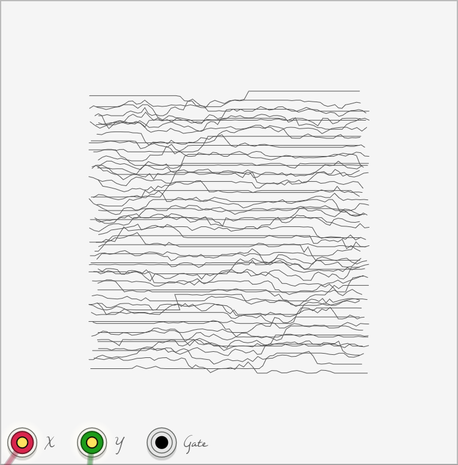
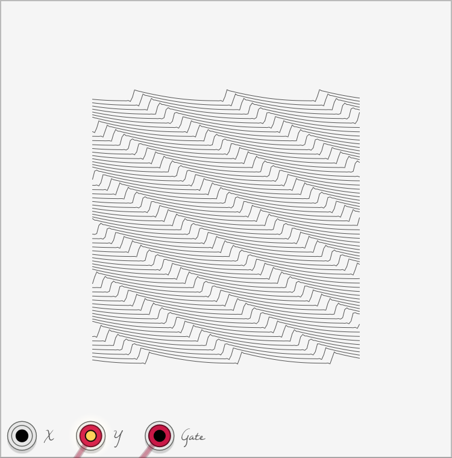

# Not Straight Lines

A signal visualizer for VCV Rack based on the work of Sol LeWitt.

https://www.sollewittprints.org/lewitt-raisonne-2003-02

Complex waveform produced by [Vult Noxious](https://modlfo.github.io/VultModules/noxious/).

Sawtooth wave from [Fundamental](https://vcvrack.com/Fundamental.html) VCO-1.

Transient produced by [Audible Instruments](https://vcvrack.com/AudibleInstruments.html) Modal Synthesizer.
